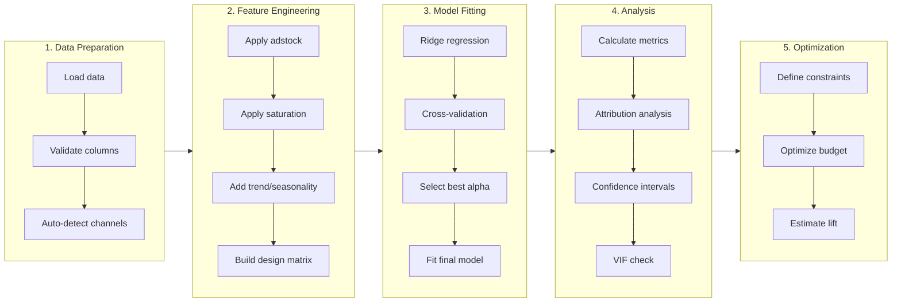
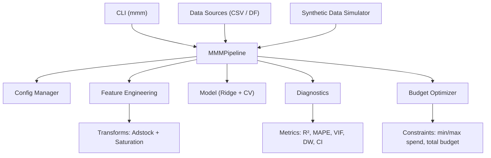

# MMM Analytics
**Production-Grade Marketing Mix Modeling for Ad Tech & Media Analytics**

[Features](#-key-features) • [Installation](#-installation) • [Quick-Start](#-quick-start) • [Architecture](#-architecture) • [Documentation](#-documentation) • [Testing](#-testing) • [Contributing](#-contributing) • [License](#-license)

---

## 🎯 What is Marketing Mix Modeling?

Marketing Mix Modeling (MMM) is a statistical technique used to quantify the impact of marketing investments (e.g., Search, Social, TV, Display) on business outcomes (e.g., revenue, conversions). This project provides a complete, production-oriented toolkit for:

- Measuring advertising effectiveness across channels  
- Attributing outcome impact to media spend drivers  
- Optimizing budget allocation to maximize ROI under constraints  

> If you have dashboards/screenshots, add them here (optional):  
> ``

---

## ✨ Key Features

| Feature | Description |
|---|---|
| 📊 Complete MMM Pipeline | End-to-end workflow from raw data to model outputs and insights |
| 🔄 Adstock & Saturation | Industry-standard media transformations (carryover + diminishing returns) |
| 📈 Statistical Diagnostics | R², MAPE, VIF, Durbin–Watson, confidence intervals |
| 💰 Budget Optimization | Multiple methods (SciPy SLSQP, greedy, gradient-based) |
| 🎨 Visualization Suite | Plots for diagnostics, attribution, and response curves |
| 🖥️ CLI Interface | Command-line tools for automation and reproducibility |
| 🧪 Synthetic Data | Built-in data generator with known ground truth |
| ✅ Production Ready | Type hints, tests, CI/CD-ready structure, pre-commit tooling |

---

## 🏗️ Architecture

### System Overview: MMM Pipeline Flow



### Component Architecture



---

## 📦 Installation

### From Source (Recommended for development)

```bash
git clone https://github.com/Sai-Santhosh/marketing-mix-modeling.git
cd marketing-mix-modeling
pip install -e ".[dev]"
```

### From PyPI (Only if you actually published it)

```bash
pip install mmm-analytics
```

### Requirements

- Python 3.10+
- NumPy, Pandas, Scikit-learn, SciPy
- Matplotlib (and optional Seaborn for extra visuals)
- Click, Rich (CLI)

---

## 🚀 Quick Start

### Python API

```python
from mmm_analytics import MMMPipeline
from mmm_analytics.data import DataSimulator

# Generate synthetic marketing data
simulator = DataSimulator(n_weeks=104, seed=42)
data = simulator.generate()

# Run the MMM pipeline
pipeline = MMMPipeline()
results = pipeline.fit(data)

# View results
print(results.model_results.summary())
```

### Command Line Interface

```bash
# Run complete demo
mmm demo

# Generate synthetic data
mmm generate --weeks 104 --output data.csv

# Run analysis on data
mmm run --data data.csv --output ./results

# Generate config template
mmm init --output config.json
```

---

## 📖 Documentation

### Adstock Transformation

Adstock captures carryover effects where advertising impact persists and decays over time:

$$A_t = X_t + \text{decay} \cdot A_{t-1}$$

```python
from mmm_analytics.core.transforms import AdstockTransformer

transformer = AdstockTransformer(decay=0.5)
spend = [100, 0, 0, 0, 0]
adstocked = transformer.transform(spend)
print(adstocked)  # [100.0, 50.0, 25.0, 12.5, 6.25]
```

### Saturation (Hill Function)

The Hill function models diminishing returns:

$$S(x) = \frac{x^\alpha}{x^\alpha + k^\alpha}$$

Where:
- **α** controls steepness  
- **k** is the half-saturation point (EC50)

```python
from mmm_analytics.core.transforms import SaturationTransformer

transformer = SaturationTransformer(alpha=2.0, k=500.0)
spend = [0, 250, 500, 750, 1000]
saturated = transformer.transform(spend)
print(saturated)
```

### Statistical Diagnostics

Available metrics:

| Category | Metrics |
|---|---|
| Goodness of Fit | R², Adjusted R², RMSE, MAE, MAPE, WMAPE |
| Multicollinearity | Variance Inflation Factor (VIF) |
| Autocorrelation | Durbin–Watson, Ljung–Box Q |
| Normality | Shapiro–Wilk, Jarque–Bera, D’Agostino K² |
| Uncertainty | Bootstrap confidence intervals |

### Budget Optimization

| Method | Description | Best For |
|---|---|---|
| `scipy` | SLSQP constrained optimization | Complex constraints |
| `greedy` | Iterative reallocation | Quick estimates |
| `gradient` | Gradient-based search | Large portfolios |

```python
from mmm_analytics.core.optimizer import BudgetOptimizer, OptimizationConstraints

optimizer = BudgetOptimizer(method="scipy")

constraints = OptimizationConstraints(
    total_budget=100000,
    min_spend={"search": 10000},
    max_spend={"search": 50000},
)

result = optimizer.optimize(
    current_spend={"search": 20000, "social": 30000, "tv": 50000},
    coefficients={"search": 0.12, "social": 0.08, "tv": 0.05},
    constraints=constraints,
)

print(result.summary())
```

---

## 📁 Project Structure

```text
marketing-mix-modeling/
├── mmm_analytics/
│   ├── __init__.py
│   ├── cli.py
│   ├── config.py
│   ├── core/
│   │   ├── transforms.py
│   │   ├── features.py
│   │   ├── model.py
│   │   ├── optimizer.py
│   │   └── pipeline.py
│   ├── data/
│   │   └── simulator.py
│   └── diagnostics/
│       ├── metrics.py
│       └── plots.py
├── tests/
├── assets/
├── .github/workflows/
├── pyproject.toml
└── README.md
```

---

## 🧪 Testing

```bash
# Run all tests
python -m pytest tests -v

# Run with coverage
python -m pytest tests --cov=mmm_analytics --cov-report=html

# Run a specific module
python -m pytest tests/test_transforms.py -v
```

---

## 🤝 Contributing

Contributions are welcome. See `CONTRIBUTING.md` for guidelines.

### Development Setup

```bash
git clone https://github.com/Sai-Santhosh/marketing-mix-modeling.git
cd marketing-mix-modeling

python -m venv .venv
source .venv/bin/activate  # Windows: .venv\Scripts\activate

pip install -e ".[dev]"

pytest -v
ruff check mmm_analytics tests
```

---

## 📚 References

### Academic / Industry
- Jin, Y., et al. (2017). *Bayesian Methods for Media Mix Modeling with Carryover and Shape Effects.* Google Research.
- Chan, D., & Perry, M. (2017). *Challenges and Opportunities in Media Mix Modeling.* Google Research.
- Zhang, S., & Vaver, J. (2017). *Introduction to the Aggregate Marketing System Simulator.* Google Research.

### Related Projects
- LightweightMMM (Google)
- PyMC-Marketing (PyMC Labs)
- Robyn (Meta)

---

## 📄 License

MIT License. See `LICENSE`.

---

## 👤 Author

**Sai Santhosh V**  
GitHub: [@Sai-Santhosh](https://github.com/Sai-Santhosh)
