<p align="center">
  
  
  
  
</p>

<h1 align="center">MMM Analytics</h1>

<p align="center">
  <strong>Production-Grade Marketing Mix Modeling for Ad Tech & Media Analytics</strong>
</p>

<p align="center">
  <a href="#-key-features">Features</a> •
  <a href="#-installation">Installation</a> •
  <a href="#-quick-start">Quick Start</a> •
  <a href="#-architecture">Architecture</a> •
  <a href="#-documentation">Documentation</a> •
  <a href="#-contributing">Contributing</a>
</p>

---

## 🎯 What is Marketing Mix Modeling?

Marketing Mix Modeling (MMM) is a statistical analysis technique used to measure the impact of various marketing tactics on sales and business outcomes. This package provides a complete, production-ready toolkit for:

- **Measuring advertising effectiveness** across channels
- **Attributing marketing impact** to specific media investments
- **Optimizing budget allocation** for maximum ROI

<p align="center">
  
</p>

---

## ✨ Key Features

| Feature | Description |
|---------|-------------|
| 📊 **Complete MMM Pipeline** | End-to-end workflow from raw data to insights |
| 🔄 **Adstock & Saturation** | Industry-standard media transformations |
| 📈 **Statistical Diagnostics** | R², MAPE, VIF, Durbin-Watson, confidence intervals |
| 💰 **Budget Optimization** | Multiple algorithms (scipy, greedy, gradient) |
| 🎨 **Visualization Suite** | Publication-ready plots and charts |
| 🖥️ **CLI Interface** | Command-line tools for automation |
| 🧪 **Synthetic Data** | Built-in data generator with known ground truth |
| ✅ **Production Ready** | Type hints, 151 tests, CI/CD, comprehensive docs |

---

## 🏗️ Architecture

### System Overview


### MMM Pipeline Flow

```mermaid
flowchart LR
    subgraph Stage1["1️⃣ Data Preparation"]
        A1[Load Data] --> A2[Validate Columns]
        A2 --> A3[Auto-detect Channels]
    end
    
    subgraph Stage2["2️⃣ Feature Engineering"]
        B1[Apply Adstock] --> B2[Apply Saturation]
        B2 --> B3[Add Trend/Seasonality]
        B3 --> B4[Build Design Matrix]
    end
    
    subgraph Stage3["3️⃣ Model Fitting"]
        C1[Ridge Regression] --> C2[Cross-Validation]
        C2 --> C3[Select Best Alpha]
        C3 --> C4[Fit Final Model]
    end
    
    subgraph Stage4["4️⃣ Analysis"]
        D1[Calculate Metrics] --> D2[Attribution Analysis]
        D2 --> D3[Confidence Intervals]
        D3 --> D4[VIF Check]
    end
    
    subgraph Stage5["5️⃣ Optimization"]
        E1[Define Constraints] --> E2[Optimize Budget]
        E2 --> E3[Calculate Lift]
    end
    
    Stage1 --> Stage2 --> Stage3 --> Stage4 --> Stage5
    
    style Stage1 fill:#bbdefb
    style Stage2 fill:#c8e6c9
    style Stage3 fill:#fff9c4
    style Stage4 fill:#ffccbc
    style Stage5 fill:#e1bee7
```



### Component Architecture


---

## 📦 Installation

### From PyPI (Recommended)

```bash
pip install mmm-analytics
```

### From Source

```bash
git clone https://github.com/saisanthoshv/mmm-analytics.git
cd mmm-analytics
pip install -e ".[dev]"
```

### Requirements

- Python 3.10+
- NumPy, Pandas, Scikit-learn, SciPy
- Matplotlib, Seaborn (visualization)
- Click, Rich (CLI)

---

## 🚀 Quick Start

### Python API

```python
from mmm_analytics import MMMPipeline
from mmm_analytics.data import DataSimulator

# Generate synthetic marketing data
simulator = DataSimulator(n_weeks=104, seed=42)
data = simulator.generate()

# Run the MMM pipeline
pipeline = MMMPipeline()
results = pipeline.fit(data)

# View results
print(results.model_results.summary())
```

### Command Line Interface

```bash
# Run complete demo
mmm demo

# Generate synthetic data
mmm generate --weeks 104 --output data.csv

# Run analysis on data
mmm run --data data.csv --output ./results

# Generate config template
mmm init --output config.json
```

---

## 📖 Documentation

### Core Transformations

#### Adstock Transformation

The adstock model captures the **carryover effect** of advertising, where the impact of an ad exposure persists and decays over time.

**Mathematical formulation:**
```
A(t) = X(t) + decay × A(t-1)
```

<p align="center">
  
</p>

```python
from mmm_analytics.core.transforms import AdstockTransformer

transformer = AdstockTransformer(decay=0.5)
spend = [100, 0, 0, 0, 0]
adstocked = transformer.transform(spend)
# Result: [100.0, 50.0, 25.0, 12.5, 6.25]
```

#### Saturation (Hill Function)

The Hill function models **diminishing returns** at high spend levels.

**Mathematical formulation:**
```
S(x) = x^α / (x^α + k^α)
```

Where:
- `α` (alpha): Shape parameter controlling curve steepness
- `k`: Half-saturation point (EC50)

<p align="center">
  
</p>

```python
from mmm_analytics.core.transforms import SaturationTransformer

transformer = SaturationTransformer(alpha=2.0, k=500.0)
spend = [0, 250, 500, 750, 1000]
saturated = transformer.transform(spend)
# Result: [0.0, 0.2, 0.5, 0.692, 0.8]
```

---

### Channel Attribution

The model calculates the contribution of each marketing channel to overall performance:

<p align="center">
  
</p>

---

### Statistical Diagnostics

Comprehensive metrics for model evaluation:

<p align="center">
  
</p>

**Available Metrics:**

| Category | Metrics |
|----------|---------|
| **Goodness of Fit** | R², Adjusted R², RMSE, MAE, MAPE, WMAPE |
| **Multicollinearity** | Variance Inflation Factor (VIF) |
| **Autocorrelation** | Durbin-Watson, Ljung-Box Q-statistic |
| **Normality** | Shapiro-Wilk, Jarque-Bera, D'Agostino K² |
| **Uncertainty** | Bootstrap confidence intervals |

---

### Budget Optimization


Three optimization methods available:

| Method | Description | Best For |
|--------|-------------|----------|
| `scipy` | SLSQP constrained optimization | Complex constraints |
| `greedy` | Iterative reallocation | Quick estimates |
| `gradient` | Gradient descent | Large portfolios |

```python
from mmm_analytics.core.optimizer import BudgetOptimizer, OptimizationConstraints

optimizer = BudgetOptimizer(method="scipy")

constraints = OptimizationConstraints(
    total_budget=100000,
    min_spend={"search": 10000},
    max_spend=50000,
)

result = optimizer.optimize(
    current_spend=current_allocation,
    coefficients=model_coefficients,
    constraints=constraints,
)

print(result.summary())
```

---

## 📁 Project Structure

```
mmm-analytics/
├── mmm_analytics/
│   ├── __init__.py           # Package exports
│   ├── cli.py                # CLI interface
│   ├── config.py             # Configuration management
│   ├── core/
│   │   ├── transforms.py     # Adstock & saturation
│   │   ├── features.py       # Feature engineering
│   │   ├── model.py          # Ridge regression model
│   │   ├── optimizer.py      # Budget optimization
│   │   └── pipeline.py       # End-to-end pipeline
│   ├── data/
│   │   └── simulator.py      # Synthetic data generation
│   └── diagnostics/
│       ├── metrics.py        # Statistical metrics
│       └── plots.py          # Visualization
├── tests/                    # 151 tests
├── assets/                   # Documentation images
├── .github/workflows/        # CI/CD pipelines
├── pyproject.toml           # Project configuration
└── README.md
```

---

## 🧪 Testing

```bash
# Run all tests
python -m pytest tests -v

# Run with coverage
python -m pytest tests --cov=mmm_analytics --cov-report=html

# Run specific test module
python -m pytest tests/test_transforms.py -v
```

**Test Results:** 151 tests passing ✅

---

## 🔄 CI/CD Pipeline


---

## 🤝 Contributing

Contributions are welcome! Please see [CONTRIBUTING.md](CONTRIBUTING.md) for guidelines.

### Development Setup

```bash
# Clone the repository
git clone https://github.com/saisanthoshv/mmm-analytics.git
cd mmm-analytics

# Create virtual environment
python -m venv .venv
source .venv/bin/activate  # or .venv\Scripts\activate on Windows

# Install in development mode
pip install -e ".[dev]"

# Run tests
python -m pytest tests -v

# Run linting
ruff check mmm_analytics tests
```

---

## 📚 References

### Academic Papers

1. Jin, Y., et al. (2017). "Bayesian Methods for Media Mix Modeling with Carryover and Shape Effects." Google Research.
2. Chan, D., & Perry, M. (2017). "Challenges and Opportunities in Media Mix Modeling." Google Research.
3. Zhang, S., & Vaver, J. (2017). "Introduction to the Aggregate Marketing System Simulator." Google Research.

### Related Projects

- [LightweightMMM](https://github.com/google/lightweight_mmm) - Google's Bayesian MMM
- [PyMC-Marketing](https://github.com/pymc-labs/pymc-marketing) - PyMC Labs MMM
- [Robyn](https://github.com/facebookexperimental/Robyn) - Meta's MMM solution

---

## 📄 License

This project is licensed under the MIT License - see the [LICENSE](LICENSE) file for details.

---

## 👤 Author

**Sai Santhosh V**

- GitHub: [@saisanthoshv](https://github.com/Sai-Santhosh)

---

<p align="center">
  Made with ❤️ for the Ad Tech & Media Analytics community
</p>
